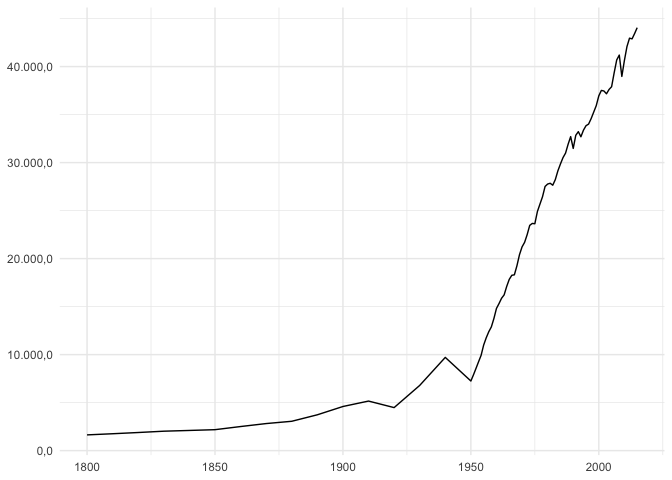
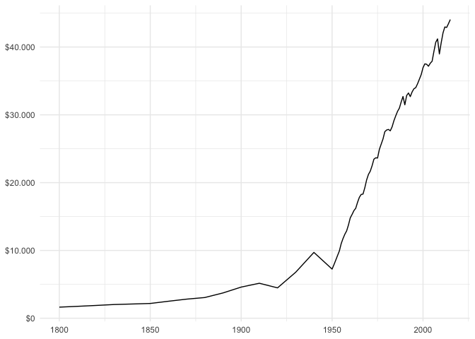
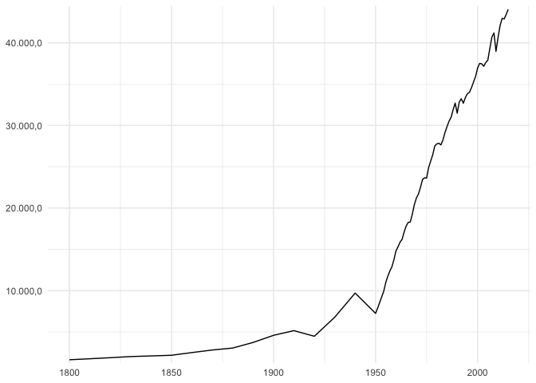
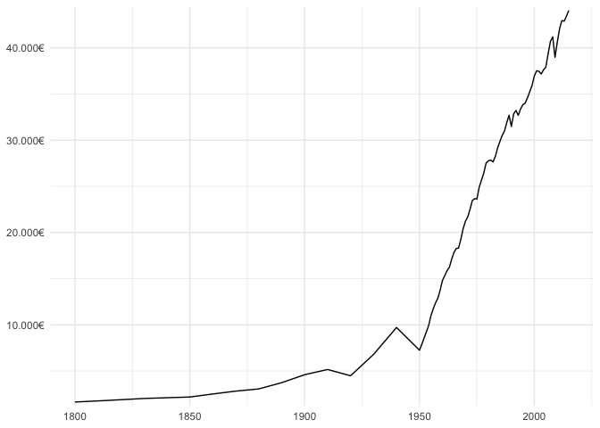

<!-- README.md is generated from README.Rmd. Please edit that file -->

# gscales

<!-- badges: start -->
<!-- badges: end -->

The goal of gscales is to make it easy to style axes and legends and to
format numbers when displaying numeric data as text labels following
style conventions used in Germany (as well as in several other
countries) using a dot (`.`) as the default big mark or thousands
seperator and a comma (`,`) as the decimal mark.

## Installation

You can install the development version of gscales like so:

``` r
remotes::install_github("trekonom/gscales")
```

## Getting Started

The gscales provides

1.  wrappers around the `label_xxxx` family of functions from the
    [`scales`](https://scales.r-lib.org) package. Following the Alpha-2
    code for Germany all wrappers have a suffix `_de`.

2.  convenience functions to make it easy to style axes using German
    number formatting when using
    [`ggplot2`](https://ggplot2.tidyverse.org).

### Formatting numbers

``` r
library(scales)
library(gscales)

x <- 12345689.987654321
```

#### … using the scales package

``` r
label_number(
  big.mark = ".",
  decimal.mark = ",",
  accuracy = .1
)(x)
#> [1] "12.345.690,0"
label_dollar(
  big.mark = ".",
  decimal.mark = ","
)(x)
#> [1] "$12.345.690"
label_number(
  big.mark = ".",
  decimal.mark = ",",
  suffix = "\u20ac"
)(x)
#> [1] "12.345.690€"
```

#### … Using the gscales package

``` r
label_number_de(accuracy = .1)(x)
#> [1] "12.345.690,0"
label_dollar_de()(x)
#> [1] "$12.345.690"
label_euro_de()(x)
#> [1] "12.345.690€"
```

### Styling axes

``` r
library(ggplot2)

p <- ggplot(gapminder[gapminder$country == "Germany", ], aes(year, gdp_per_cap)) +
  geom_line() +
  theme_minimal() +
  labs(x = NULL, y = NULL)
```

#### … using the scales package

``` r
p +
  scale_y_continuous(
    labels = label_number(
      big.mark = ".",
      decimal.mark = ",",
      accuracy = .1
    )
  )
```



``` r
p +
  scale_y_continuous(
    labels = label_dollar(
      big.mark = ".",
      decimal.mark = ","
    )
  )
```



``` r
p +
  scale_y_continuous(
    labels = label_number(
      big.mark = ".",
      decimal.mark = ",",
      suffix = "\u20ac"
    )
  )
```


#### … using the gscales package

``` r
p + scale_y_number_de(accuracy = .1)
```



``` r
p + scale_y_dollar_de()
```


``` r
p + scale_y_euro_de()
```


