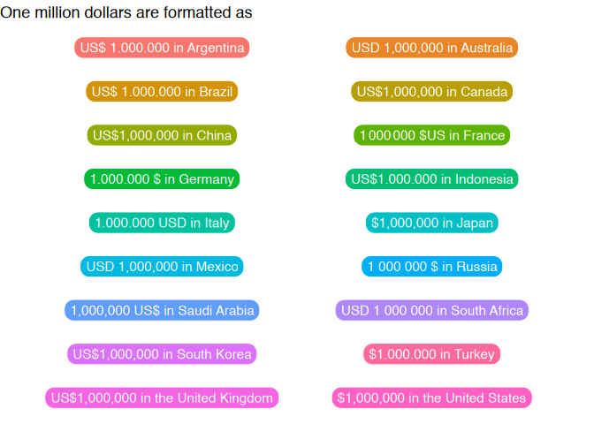
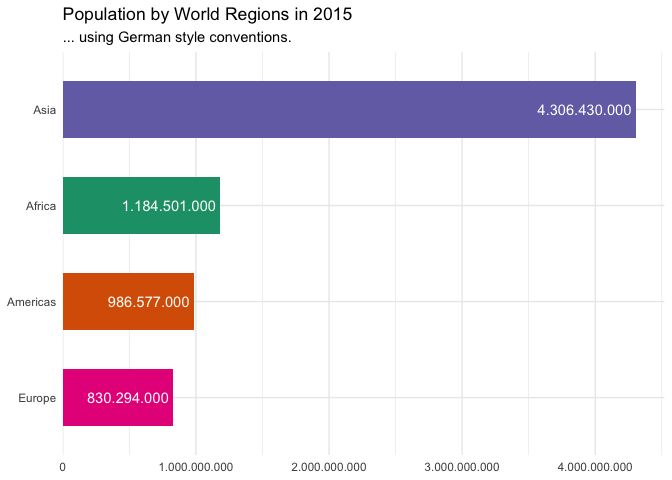

<!-- README.md is generated from README.Rmd. Please edit that file -->

# countryscales

<!-- badges: start -->
<!-- badges: end -->

`countryscales` extends [`scales`](https://scales.r-lib.org) and
[`ggplot2`](https://ggplot2.tidyverse.org) by providing functions to
make it easy to display numbers or label axis text on positional scales
in decimal format, as percentages or currencies using country- or
locale-specific style conventions.

## Installation

You can install the development version of `countryscales` from GitHub
using:

``` r
remotes::install_github("trekonom/countryscales")
```

## Note on supported locales

`countryscales` uses data on locale-specific numbering formats from the
Common Locale Data Repository
([CLDA](https://en.wikipedia.org/wiki/Common_Locale_Data_Repository))
provided for easy use in R by the
[`i18n`](https://rich-iannone.github.io/i18n/) package. Right now
`countryscales` supports 552 of the 574 locales listed in `i18n`. Not
supported are locales which deviate from the international norm for
grouping digits by threes. This includes locales using the [Indian
numbering system](https://en.wikipedia.org/wiki/Indian_numbering_system)
which

> groups the rightmost three digits together (until the hundreds place),
> and thereafter groups by sets of two digits.

## Usage

The most common use case for countryscales is to customize the
appearance of axis and legend labels or format numbers added as labels
to a plot using country-specific style conventions.

Here’s an example showing how 1 million USD are formatted according to
style conventions in the G20 countries:

``` r
library(countryscales)
library(ggplot2)
library(dplyr, warn.conflicts = FALSE)

g20 <- countryscales::g20 |>
  # India is not supported
  filter(iso2c != "IN") |>
  mutate(
    x = factor(rep(1:2, 9)),
    y = factor(rep(9:1, each = 2)),
    country = if_else(iso2c %in% c("US", "GB"), paste("the", country), country),
    locale = if_else(iso2c == "CN", "zh-Hans-CN", locale),
    value = purrr::map_chr(
      locale,
      ~ label_currency_locale(locale = .x, currency = "USD")(1e6)
    )
  )

ggplot(g20, aes(x = x, y = y)) +
  geom_label(
    aes(label = paste(value, "in", country), fill = country),
    label.padding = unit(5, "pt"), label.r = unit(8, "pt"),
    color = "white"
  ) +
  theme_void() +
  labs(
    title = "One million dollars are formatted as"
  ) +
  guides(fill = "none")
```



``` r
base <- gapminder15 |>
  count(region, wt = pop) |>
  ggplot(
    aes(n, reorder(region, n),
      fill = region
    )
  ) +
  scale_fill_brewer(palette = "Dark2") +
  geom_col(width = .6) +
  theme_minimal() +
  labs(
    x = NULL, y = NULL,
    title = "Default"
  ) +
  guides(fill = "none")
```

As another example, let’s look at formatting a chart according to German
style conventions, where a dot (`.`) is used as the big mark.

You can use the `countryscales` package to get this result with the
`scale_x/y_xx_locale` and `label_xxx_locale` functions like so:

``` r
base +
  geom_label(
    aes(
      label = label_number_locale(
        locale = "de-DE", accuracy = 1000
      )(n)
    ),
    hjust = 1, fill = NA,
    label.size = NA, color = "white"
  ) +
  scale_x_number_locale(
    locale = "de-DE",
    expand = expansion(mult = c(0, .05))
  ) +
  labs(title = "German style conventions.")
```



countryscales also has some handy functions for common locales. For
instance, you can use the `label_number_ch` and `scale_x_number_ch` to
format the plot using Swiss style conventions:

``` r
base +
  geom_label(
    aes(
      label = label_number_ch(accuracy = 1000)(n)
    ),
    hjust = 1, fill = NA,
    label.size = NA, color = "white"
  ) +
  scale_x_number_ch(
    expand = expansion(mult = c(0, .05))
  ) +
  labs(title = "Swiss style conventions.")
```


