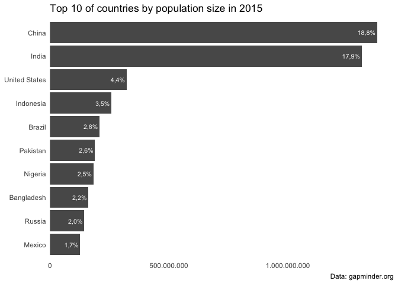

<!-- README.md is generated from README.Rmd. Please edit that file -->

# countryscales

<!-- badges: start -->
<!-- badges: end -->

`countryscales` extends the [`scales`](https://scales.r-lib.org) package
to make it easy to display numbers according to country-specific style
conventions. Additionally `countryscales` extends `ggplot2` by providing
a set of positional scale functions to make it easy to style axes
displaying numbers, percentages or currencies.

## Installation

You can install the development version of `countryscales` like so:

``` r
remotes::install_github("trekonom/countryscales")
```

## The problem

Let’s say you have to prepare a report or charts where you have to

-   use country specific style conventions to display numbers which
    differ from the default anglo-american style,
-   display numbers on charts, axes or legends in decimal format, as
    percentages or as currencies.

To achieve that the `scales` package provides a family of easy to use
functions like `scales::label_number` or `scales::percent` which could
also be passed to the `labels` argument of `ggplot2`s family of scale
functions.

However, in practice formatting numbers and styling axes quickly becomes
cumbersome and annoying as you always have to

-   set the decimal and grouping marks if deviating from the defaults so
    you end up with something like

        scales::label_number(big.mark = ".", decimal.mark = ",")(x)

    to format a number `x` in decimal format.

-   provide a suitable labeller function to the `labels` argument of
    `scale_xxx_yyy` (and of course additionally switch the … (; ) so you
    end up with something like

        scale_x_continuous(labels = scales::label_percent(big.mark = ".", decimal.mark = ","))

    to display numbers on the x axis as percentages.

## The solution

A first and simple solution to this problem would be to add some simple
wrappers at the beginning of your R script or R markdown document like

    my_label_number <- function() {
      scales::label_number(big.mark = ".", decimal.mark = ",")
    }

But then you end up copy and pasting from one report to the next, so
sooner or later you probably put these helpers inside package.

And that’s the goal of `countryscales`: Providing out-of-the-box helpers
to format numbers using country-specific style conventions.

As a first example consider formatting a number according to style
conventions used in Germany and several other European countries where a
dot (`.`) is used as the big mark or grouping mark or thousands
seperator and a comma (`,`) as the decimal mark.

Using `scales::label_number` this requires to switch the default decimal
and big marks:

``` r
library(scales)

label_number(big.mark = ".", decimal.mark = ",", accuracy = .1)(x)
#> [1] "12.345.690,0"
```

Using `countryscales` this could be achieved with less typing using
`countryscales::label_number_de`:

``` r
library(countryscales)

label_number_de(accuracy = .1)(x)
#> [1] "12.345.690,0"
```

To provide an example of using `countryscales` with `ggplot2` let’s
first prepare a small example dataset of the top 10 countries according
to population size:

``` r
top10_pop <- gapminder15[order(-gapminder15$pop), c("country", "pop")]
top10_pop$pct <- top10_pop$pop / sum(top10_pop$pop)
top10_pop <- head(top10_pop, 10)
```

As a basic example let’s make a simple barchart of population size by
country

``` r
library(ggplot2)

p <- ggplot(top10_pop, aes(pop, reorder(country, pop))) +
  geom_col() +
  theme_minimal() +
  theme(panel.grid.major = element_blank(), 
        panel.grid.minor = element_blank()) +
  labs(
    x = NULL, y = NULL,
    title = "Top 10 of countries by population size in 2015",
    caption = "Data: gapminder.org"
  )
```

While this chart is fine it’s not ready for publication. Let’s say we
want to display population sizes on the x axis in decimal format and
additionally add the share of each country on World population formatted
as percentages as labels to the bars using German style conventions.

Using `scales` this could be achieved like so:

``` {style-scales}
p +
  # Add percentages to bars using German style conventions
  geom_text(
    aes(
      label = label_percent(big.mark = ".", 
                            decimal.mark = ",", 
                            accuracy = .1)(pct)), 
    hjust = 1.1, size = 8 / .pt, color = "white") +
  # Format numbers as percentages
  scale_x_continuous(
    labels = label_number(big.mark = ".", 
                          decimal.mark = ","), 
    expand = c(0, 0, .05, 0))
```

As this simple example shows displaying numbers in decimal format or as
pwercentages requires some typing, especially if you want to or have to
deviate from default decimal and grouping marks.

That’s where `countryscales` comes in handy as using `label_percent_de`
and `scale_x_number_de` the same could be achieved with less typing like
so:

``` r
p +
  # Add percentages to bars using German style conventions
  geom_text(
    aes(
      label = label_percent_de(accuracy = .1)(pct)), 
    hjust = 1.1, size = 8 / .pt, color = "white") +
  # Format numbers as percentages
  scale_x_number_de(expand = c(0, 0, .05, 0))
```


