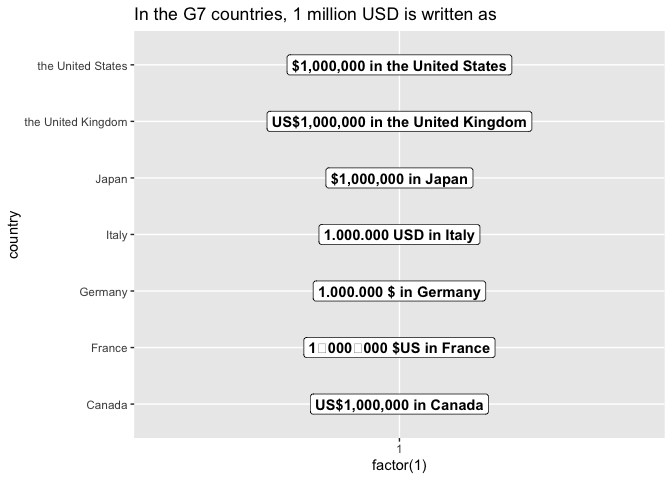

<!-- README.md is generated from README.Rmd. Please edit that file -->

# countryscales

<!-- badges: start -->
<!-- badges: end -->

`countryscales` extends the [`scales`](https://scales.r-lib.org) package
to make it easy to display numbers according to country-specific style
conventions. Additionally `countryscales` extends
[`ggplot2`](https://ggplot2.tidyverse.org) by providing a set of
positional scale functions to make it easy to style axes displaying
numbers, percentages or currencies.

## Installation

You can install the development version of `countryscales` from GitHub
using:

``` r
remotes::install_github("trekonom/countryscales")
```

## Usage

The most common use case for countryscales is to customise the
appearance of axis and legend labels or format numbers added as labels
to a plot using country-specific style conventions.

As a first example consider formatting a chart according to style
conventions used in Germany and several other European countries where a
dot (`.`) is used as the big mark or grouping mark or thousands
seperator and a comma (`,`) as the decimal mark.

Using `countryscales` this could be achieved using the
`scale_x/y_xxx_locale` and `label_xxx_locale` family of functions like
so:

``` r
library(countryscales)
library(ggplot2)
library(dplyr, warn.conflicts = FALSE)

base <- gapminder15 |>
  count(region, wt = pop) |>
  ggplot(
    aes(n, reorder(region, n),
      fill = region
    )
  ) +
  scale_fill_brewer(palette = "Dark2") +
  geom_col(width = .6) +
  theme_minimal() +
  labs(
    x = NULL, y = NULL,
    title = "Population by World Regions in 2015"
  ) +
  guides(fill = "none")

base +
  geom_label(
    aes(
      label = label_number_locale(
        locale = "de-DE",
        accuracy = 1000
      )(n)
    ),
    hjust = 1,
    fill = NA,
    label.size = NA,
    color = "white"
  ) +
  scale_x_number_locale(
    locale = "de-DE",
    expand = expansion(mult = c(0, .05))
  ) +
  labs(subtitle = "... using German style conventions.")
```



Besides the `_locale` family of functions countryscales provides
convenience functions for most common locales, e.g. to format the plot
using Swiss style conventions you could achieve the same result using
`label_number_ch` and `scale_x_number_ch` like so:

``` r
base +
  geom_label(
    aes(
      label = label_number_ch(accuracy = 1000)(n)
    ),
    hjust = 1,
    fill = NA,
    label.size = NA,
    color = "white"
  ) +
  scale_x_number_ch(
    expand = expansion(mult = c(0, .05))
  ) +
  labs(subtitle = "... using Swiss style conventions.")
```


